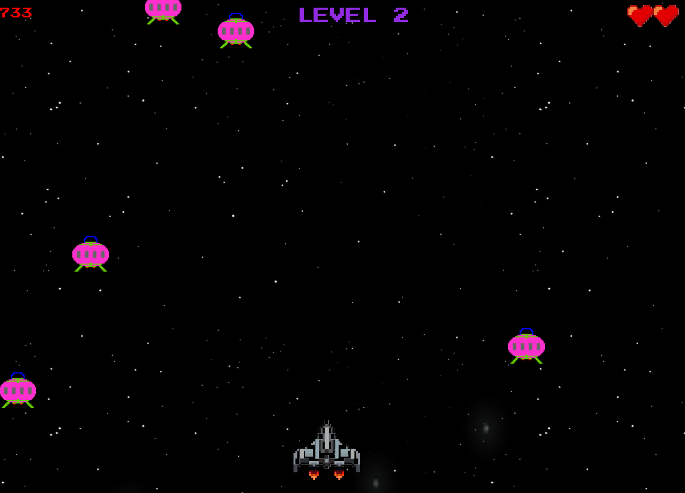

# Object Oriented Programming Game Project

## Introduction

-A space invader type of game created to practive OOP. The ship can move, shoot and collide with enemy invadors. 
-Created on HTML5 Canvas a random star generateor which give the appearance of moving trough space.